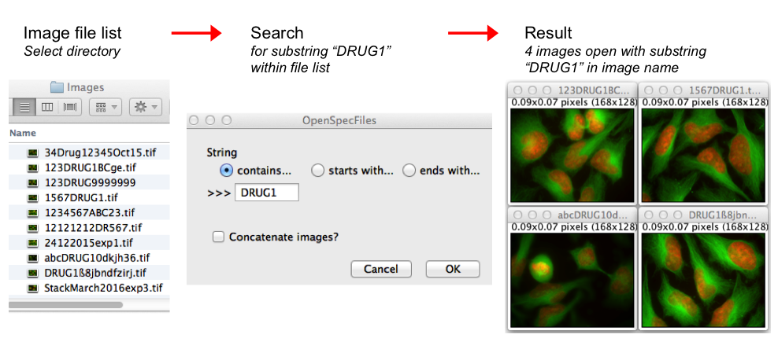
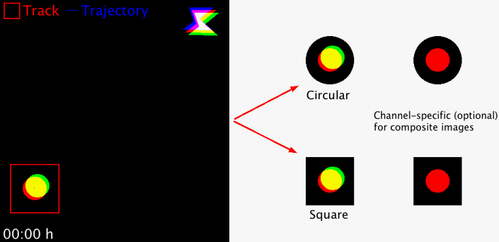
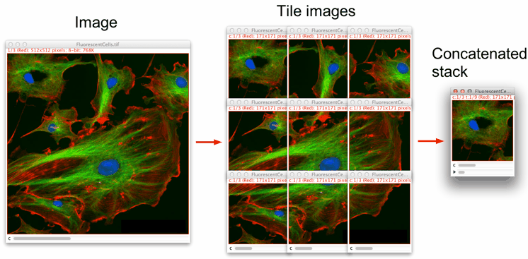

# Macros
ImageJ/FIJI macros

<b>Open Specific Images from Folder</b> 
<i>Program</i>: <a href="./OpenSpecFiles.ijm">OpenSpecFiles</a>							
 
This macro opens files from a selected folder plus subfolders. It only opens those files containing a user-defined substring, i.e. a partial name or number. Files that either start or end with the substring, or files that have the substring anywhere within its full name can specifically be opened. If wanted, the open images can be concatenated to a stack.							
 
<a href="./OpenSpecFiles.ijm" target="_blank"></img></a>
   

<b>ROIExtractConcatenate</b> 
<i>Program</i>: <a href="./ROI_ExtractConcatenate.ijm">ROIExtractConcatenate</a>							
 
Takes regions-of-interest (ROI) from an image series in order to extract and concatenate user-defined area selections for better object displays. The size of the area and the area shape (circular or square) can freely be chosen. The macro works with 8-, 16-, 32-bit images, RGB images and hyperstacks (i.e. composite images). For multi-channel hyperstacks, the user can choose whether to display specific channels, or all channels.							
 
<a href="./ROI_ExtractConcatenate.ijm" target="_blank"></img></a>
   

<b>SplitImage_andConcatenate</b> 
<i>Program</i>: <a href="./SplitImage_andConcatenate.ijm">SplitImageAndConcatenate</a>							
 
This macro splits an image into user-defined smaller-size images and concatenates them into a stack. It works with 8-, 16-, 32-bit, RGB and composite images.							
 
<a href="./SplitImage_andConcatenate.ijm" target="_blank"></img></a>
   
