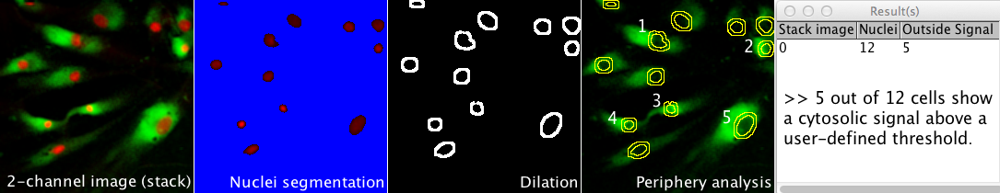
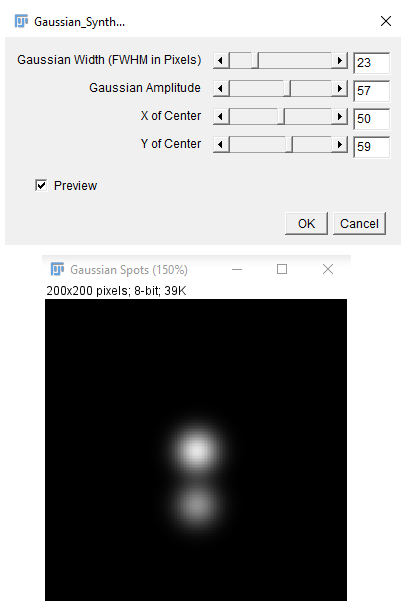

# Macros
ImageJ/FIJI macros

<b>Open Specific Images from Folder</b> 
<i>Program</i>: <a href="./OpenSpecFiles.ijm">OpenSpecFiles</a>							
 
This macro opens files from a selected folder plus subfolders. It only opens those files containing a user-defined substring, i.e. a partial name or number. Files that either start or end with the substring, or files that have the substring anywhere within its full name can specifically be opened. If wanted, the open images can be concatenated to a stack.							
 
<a href="./OpenSpecFiles.ijm" target="_blank"></img></a>
   

<b>ROIExtractConcatenate</b> 
<i>Program</i>: <a href="./ROI_ExtractConcatenate.ijm">ROIExtractConcatenate</a>							
 
Takes regions-of-interest (ROI) from an image series in order to extract and concatenate user-defined area selections for better object displays. The size of the area and the area shape (circular or square) can freely be chosen. The macro works with 8-, 16-, 32-bit images, RGB images and hyperstacks (i.e. composite images). For multi-channel hyperstacks, the user can choose whether to display specific channels, or all channels.							
 
<a href="./ROI_ExtractConcatenate.ijm" target="_blank"></img></a>
   

<b>SplitImage_andConcatenate</b> 
<i>Program</i>: <a href="./SplitImage_andConcatenate.ijm">SplitImage_andConcatenate</a>							
 
This macro splits an image into user-defined smaller-size images and concatenates them into a stack. It works with 8-, 16-, 32-bit, RGB and composite images.							
 
<a href="./SplitImage_andConcatenate.ijm" target="_blank"></img></a>
   

<b>Nuclei_PeripheryMeasure</b> 
<i>Program</i>: <a href="./Nuclei_PeripheryMeasure.ijm">Nuclei_PeripheryMeasure</a>							
 
Counts the number of cells with a cytosolic signal above a user-defined threshold within a cell population. As output, the number of criteria-matching cell counts with respect to the total number of cells is provided. The macro works on images or image stacks with two channels. In short, the macro takes the nuclear signals in one channel as reference for individual cells. Segmentation of nuclei is done by intensity thresholding. The corresponding nuclear areas are registered and used to create binary images as masks. In order to measure the cytosolic signal of the second channel, dilations are performed on the binary images in a user-defined manner to take different cell shapes into consideration. The resulting mask images with intensity values 0 (background) and 1 (foreground) are multiplied with the images of the second channel to select the areas for measurement. For the analysis, the user can specify both a general signal intensity threshold and a minimal number of pixels required above that threshold for positive counts. 						
 
<a href="./Nuclei_PeripheryMeasure.ijm" target="_blank"></img></a>
   

<b>Gaussian_Synth</b> 
<i>Program</i>: <a href="./Gaussian_Synth.java">Gaussian_Synth</a>							
 
Synthesizes a spot with Gaussian intensity on an opened image. Four parameters of Center (X and Y), width, and the intensity of the Gaussian profile can be adjusted interactively. The synthesized image can be used again to synthesize other spots (by preserving previous ones). The starting point for this Java program was the program Cross_Fader.java, written by Michael Schmid. 
Installation: Simply download this file and put it in the "Plugins" subfolder of your ImageJ (or Fiji) folder. Then, launch ImageJ (or Fiji) again. 					
 
<a href="./Gaussian_Synth.java" target="_blank"></img></a>
   
